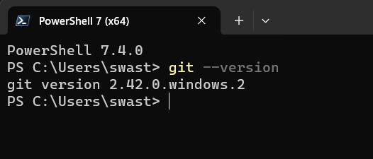
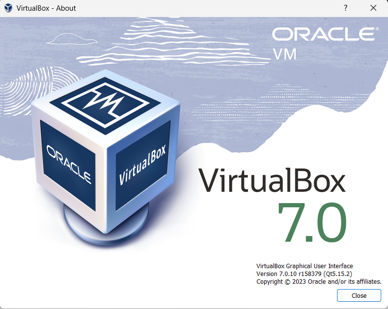
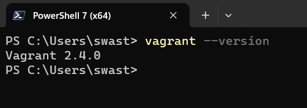
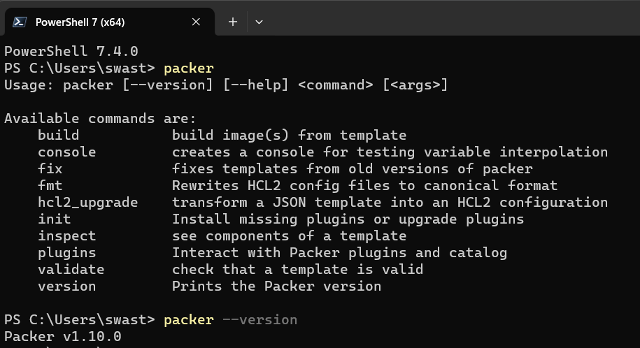

# Tooling Setup Assignment

## Objectives

* Discuss and describe modern Cloud Native tooling
* Learn and describe the advantage using modern package managers on Windows and MacOS for tooling install
* Demonstrate the advantages of using version control for documentation distribution
* Learn and discuss the use of Markdown for text based document creation

## Outcome

At the end of this assignment you will have become familiar with industry standard package managers for Windows and MacOS and be able to install standard tooling used in Cloud Native application development.  This will be achieved by following a small demo and some small tutorials.

## Overview

Complete the required installs in this document via a Package Manager and take a screenshot of the proper output to show a successful install. Place the screenshot into the document as mentioned in the last step.

### Package Managers

Package Managers are an essential tool, originally created for Linux Distributions, apt and yum, at the turn of the century, only in recent years have the major desktop operating systems, Windows and MacOS, created similar tools.  You may be more familiar with the term, "APP Store," the concept is the same either way.  

Package Managers help by streamlining a few important items:

* Package Managers provide a centralized location for installing application
  * This location is accessed through a Command Line tool
* Package Managers take care of all dependency installations
  * Any additional pieces or software or libraries are automatically installed for you
* Package Managers allow you to automate and script your installs
  * This makes installing a series of packages portable across systems
* Package Managers handle all PATH issues, updates, and single source to remove an application

### MacOS - Homebrew

Homebrew is the MacOS 3rd party package manager located at: [https://brew.sh/](https://brew.sh/ "brew installer page"). It is available for Intel and M1 based Macs -- the workflow doesn't change.

If you have a Mac - install brew and provide a screenshot of the output of the command: `brew --version`

### Windows 10 and 11

The name of the third party Windows Package manager is Chocolatey.  The download is located at [Chocolatey.org](https://chocolatey.org/ "Chocolatey.org download page").

For Windows place a screenshot of the version command output for: ```choco --version```.


### Commands to run to install all the software

**NOTE** if you have any of this software already installed, you do not need to reinstall it -- but it wouldn't hurt to upgrade everything so that we are all on the same versions.  Below I will describe what we are installing.

For MacOS using Homebrew:

`brew install --cask powershell ; brew install --cask iterm2 ; brew install git ; brew install --cask visual-studio-code ; brew install --cask atom ; brew install virtualbox ; brew install --cask vagrant ; brew install packer`

For M1 Macs you will run the same as above but without the  VirtualBox install:

`brew install --cask powershell ; brew install --cask iterm2 ; brew install git ; brew install --cask visual-studio-code ; brew install --cask atom ; brew install --cask vagrant ; brew install packer`

* For M1 Macs you will need to make a purchase of a copy of Parallels Pro
  * [https://www.parallels.com/products/desktop/pro/](https://www.parallels.com/products/desktop/pro/ "Parallels Pro Edition")
  * The standard and education edition doesn't contain the commandline interface needed for automation
  * [50% discount link](https://www.parallels.com/landingpage/pd/education/ "Parallels Pro discuount")
* Once Vagrant and Parallels Pro Edition is installed you need to also install the Parallels SDK from the Download Tab in your parallels.com account
  * From the Terminal run the command: `vagrant plugin install vagrant-parallels`
    * This will add the needed plugin to allow you to use Parallels from Vagrant
    * This will also work if you have Parallels Pro Edition on an Intel Mac

For Windows using Chocolatey:

```PowerShell
choco install powershell-core microsoft-windows-terminal git vscode vscode-powershell vagrant packer virtualbox
```

### Installation of a Modern Shell

For Windows we are going to install PowerShell Core, also known as PowerShell 7.x. Windows includes PowerShell 5 (the lightblue icon), which has ceased development and doesn't have support for modern font display.  PowerShell 7 is opensource and cross-platform available.  Working on Windows, PowerShell 7 is a must.

Open PowerShell 7 and issue the command: `ssh -V` and take a screenshot of the PowerShell version output as well as the SSH version output.


For MacOS, newer versions use the Z shell.  This is due to Apple not using GPLv3+ software, which newer versions of BASH are licensed under.  This should be just fine and not require a new shell install.  If you want to experiment you can also install PowerShell 7 via Brew but it is not required.

Open a terminal and type the commands: `zsh --version` and `ssh -V` and take a screenshot of the output

### Installation of a Modern Terminal

A Terminal is a way to run and manage multiple shell together, not unlike a web-browser, in a single managed window.  You will spend much time on in a shell during your career, the Terminal is a huge helper.

On Windows, Microsoft provides a [Windows Terminal](https://www.microsoft.com/en-us/p/windows-terminal/9n0dx20hk701?activetab=pivot:overviewtab "Install Windows Terminal from Microsoft Store")

Open the Windows Terminal and select from the drop down arrow, the ABOUT tab, and take a screenshot of the version output

On MacOS, there is a terminal called [iterm2](https://iterm2.com/ "MacOS shell terminal")

Open the iterm2 Terminal and from the File > About section take a screenshot of the version output

### Install IDE editor with native version control support

We will be installing an text editor or and IDE for all of our coding and configuration.  The key is one with native version control tooling integrated.  There are many and all can be installed via your OSes package manager, here are a list:

* [VSCode from Microsoft](https://code.visualstudio.com/ "VSCode install")
  * Cross platform and has direct shell integration
* [atom.io](https://atom.io/ "Atom.io install")
  * Built by GitHub for Git integration
* [Sublime Text](http://www.sublimetext.com/ "Submlime Text installer site")
  * Built for a MacOS native experience, A sophisticated text editor for code, markup and prose.  Available for all platforms.
* [Adobe Brackets](http://brackets.io/ "Adobe Brackets Install")
  * Cross Platform development tool from Adobe

Take a screenshot from the ABOUT tab in your IDE to show the installed version

### Install Git Client for Version Control

Version Control is vital to modern software development and we will be using our Package Manger to install the Git Client for our respective operating systems. **Note**, this is different from the GitHub Desktop tool, which we will not be using this semester.

Take a screenshot of the output of the command: ```git --version```


#### Configure Git Client

You will need to configure Git if you already haven't done so.  From a shell run these two commands:

```bash
git config --global user.name "<Your Name>"
git config --global user.email "<youremail@example.com>"
```

My information would look like this:

```bash
git config --global user.name "Jeremy Hajek"
git config --global user.email "hajek@iit.edu"
```

### Install VirtualBox or Parallels

If you do not already have VirtualBox 7.x installed, use your package manager to install VirtualBox.  VirtualBox will be our virtualization platform we are using this semester.  It is a robust opensource product and can be used to create and host machines on our local systems.  It has integration with automation tools such as Packer and Vagrant from HashiCorp.

Take a screenshot of the VirtualBox > Help > About VirtualBox output or from the Terminal: `vboxmanage --version` (Windows or Intel MacOS)





For those using an M1 Mac we will require a [Pro License from Parallels](https://www.parallels.com/products/desktop/pro/ "Pro License form parallels.com website").

Take a screenshot of Parallels Desktop > About Parallels Desktop or from the terminal : `prlctl --version` (Works on any version of Parallels)

**Note:** that you can use Parallels on an Intel MacOS as well -- you would need to make sure you have the Pro edition installed and the SDK installed as well.

### Install Vagrant

Vagrant is a tool from [HashiCorp](https://hashicorp.com "HashiCorp website").  This tool is used to abstract away the VirtualBox interface and provide direct commandline access, increasing ease of use.  *Vagrant provides easy to configure, reproducible, and portable work environments built on top of industry-standard technology and controlled by a single consistent workflow to help maximize the productivity and flexibility of you and your team.*

Using your package manager, install the latest version of [Vagrant](https://vagrantup.com "Vagrant download site").  If you have a version 2.2.x you will be ok.  Note, if using Linux, do not use the built in package manager as these versions of Vagrant and Packer are too old and unmaintained.  

Take a screenshot of the output of the command: ```vagrant --version```



### Install Packer.io

Packer is another automation tool from HashiCorp.  Whereas Vagrant was for running virtual machines, Packer's job is to build virtual machine images from a template language.  This tool allows fast infrastructure deployment, multi-provider portability, improved stability, and greater testability.

Using a package manager, install the latest version of [Packer](https://packer.io "Packer install site").  If you have a version > 1.6.x you will be ok. Note, if on Linux, do not use the built in package manager as these versions of Vagrant and Packer are too old and unmaintained.  

Take a screenshot of the output of the command: ```packer --version```



### Oh-My-Git Tutorial

Download the proper [Oh My Git! tutorial](https://ohmygit.org/ "webpage for oh my git") the program runs as a self contained executable on your system (Windows Mac or Linux).


Complete the tutorial and take screenshots of the completed sections (may need to take a few shots as the there are many sections).

This Git tutorial is a good refresher for those who need it and a great introduction for those new to Version Control and want to learn it. You can leave the last section out, **Sandbox**, it is an open area for you to experiment in and no real way to "complete it."

## Tooling Assignment Part II

Part II will explore some version control exercises and using getting familiar with Markdown

## Create and Push your Readme.md

In this step you will clone the Private GitHub repo you have been provided with by the professor (you received an invite email to it) to your local system.  In the root of this repo you will create a file named `Readme.md` and a folder named **images**. This `Readme.md` will contain the elements below written in Markdown. This is a good [Markdown cheatsheet reference](https://github.com/adam-p/markdown-here/wiki/Markdown-Cheatsheet "Markdown cheatsheet").

The document will include:

* h1 with your name
  * a picture of you
  * a picture of something that describes you
* h2 Where are you from?
  * Tell us where you are from
* h2 What was your first computing device?
* h2 IT Interests
  * Tell us what you IT Interests and or skills are
* h2 Something Interesting About You
  * Tell us something interesting about you

Push this to your GitHub private account repo.

Here is my own completed sample: [https://github.com/illinoistech-itm/jhajek/blob/master/README.md](https://github.com/illinoistech-itm/jhajek/blob/master/README.md "Professor's GitHub Repo Sample").  **Note**, I will have more folders then you because I have sample code for more classes.  If you have previously completed this assignment, no need to do anything unless you want to update the information.

### Create a .gitignore file

Every Git repository needs a `.gitignore` file.  This file tells Git to ignore certain files.  These are files that are too large, binary format, or things like security keys and passwords, that we don't want to be committing to our Git Repos.

We will create a file named: `.gitignore` and place the following values into it and add, commit, and push the file to your private repo.

```bash
#packer
*.vdi
*.box
.vagrant/
*console.log
packer-cache/
packer_cache/
*.pem
*~$
*.ova
output*/
vagrant.d/
*.iso
variables.pkr.hcl
*.priv
variables.json
.DS_Store
id_rsa
id_rsa*
id_rsa.pub
.Vagrantfile*
Vagrantfile~
config.default.yml
```

### Adding Screenshots

On your local system, clone the instructors sample code repo containing this assignment.  Issue the command: `git clone https://github.com/illinoistech-itm/jhajek.git` on your local system command line. **Note** - if you already have this repo clone just issue: `git pull` to update to the latest assignment. From your local system's file manager copy the document from the cloned repo: jhajek > itmd-521 > tooling-assignment > Readme.md and place the copied document into your own private repo on the local system under a root folder named: **itmd-521**.  In that itmd-521 directory, add an directory named: `images` and place all of your screenshots into that directory.

Open your private Repo using your IDE and now that we have worked with Markdown, I want you to go back, using the [Markdown cheatsheet reference](https://github.com/adam-p/markdown-here/wiki/Markdown-Cheatsheet "Markdown cheatsheet") and add image links under each of the screenshot statements in the assignment above.

Once complete, add, commit, and push your tooling assignment Readme.md to your GitHub Repo

### Final deliverable to Blackboard

Submit to Blackboard the URL to your GitHub private repo, so I can clone and see all these elements. You will submit URL's to the work in the Private GitHub repo to Blackboard, but the work will stay in GitHub.
